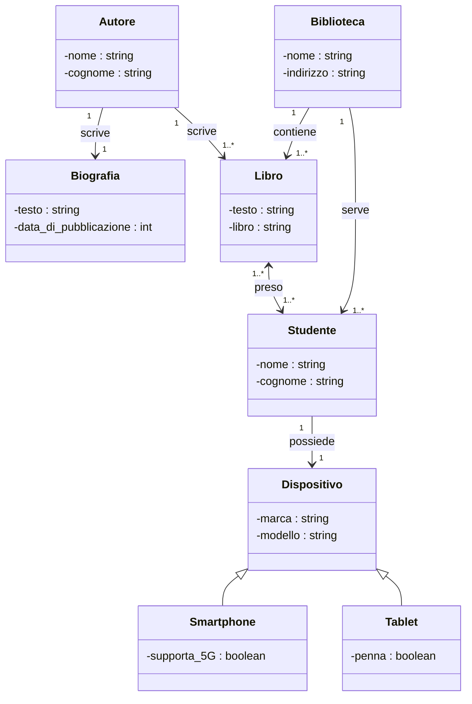

```mermaid
classDiagram
    class Autore {
        -nome : string
        -cognome : string
        
        
    }
    class Biografia {
        -testo : string
        -data_di_pubblicazione : int
        
        
    }
    class Biblioteca {
        -nome  : string
        -indirizzo : string
        
        
    }
    class Libro {
        -testo : string
        -libro : string
        
        
    }
    class Studente {
        -nome : string
        -cognome : string
        
        
    }
    class Dispositivo {
        -marca : string
        -modello : string
        
    }
    class Smartphone {
        -supporta_5G : boolean
        
        
    }
    class Tablet {
        -penna : boolean
        
        
    }
    Autore "1" --> "1" Biografia : scrive
    Autore "1" --> "1..*" Libro : scrive
    Biblioteca "1" --> "1..*" Libro : contiene 
    Biblioteca "1" --> "1..*" Studente : serve 
    Libro "1..*" <--> "1..*" Studente : preso
    Studente "1" --> "1" Dispositivo : possiede 

    Dispositivo <|-- Smartphone 
    Dispositivo <|-- Tablet 

```