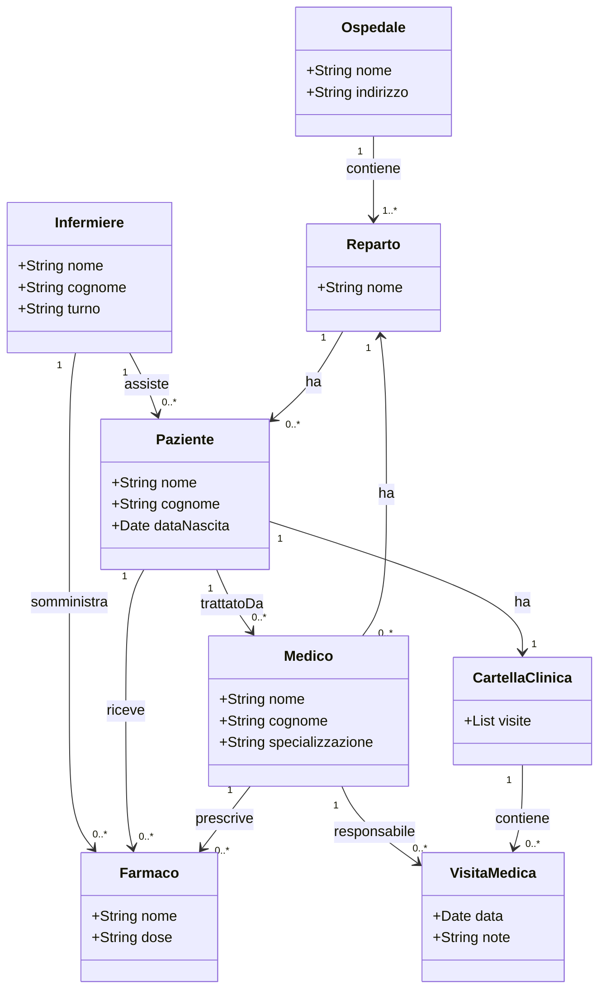

```mermaid
classDiagram
    class Ospedale {
        +String nome
        +String indirizzo
    }

    class Reparto {
        +String nome
    }

    class Medico {
        +String nome
        +String cognome
        +String specializzazione
    }

    class Farmaco {
        +String nome
        +String dose
    }

    class Paziente {
        +String nome
        +String cognome
        +Date dataNascita
    }

    class Infermiere {
        +String nome
        +String cognome
        +String turno
    }

    class CartellaClinica {
        +List<VisitaMedica> visite
    }

    class VisitaMedica {
        +Date data
        +String note
    }

    Ospedale "1" --> "1..*" Reparto : contiene
    Reparto "1" <-- "0..*" Medico : ha
    Reparto "1" --> "0..*" Paziente : ha
    Medico "1" --> "0..*" Farmaco : prescrive
    Paziente "1" --> "0..*" Farmaco : riceve
    Paziente "1" --> "0..*" Medico : trattatoDa
    Paziente "1" --> "1" CartellaClinica : ha
    CartellaClinica "1" --> "0..*" VisitaMedica : contiene
    Medico "1" --> "0..*" VisitaMedica : responsabile
    Infermiere "1" --> "0..*" Paziente : assiste
    Infermiere "1" --> "0..*" Farmaco : somministra

```