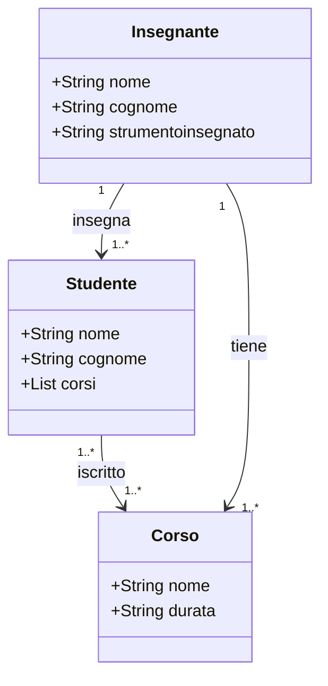

```mermaid
classDiagram
    class Insegnante {
        +String nome
        +String cognome
        +String strumentoinsegnato
    }

    class Studente {
        +String nome
        +String cognome
        +List corsi
    }

    class Corso {
        +String nome
        +String durata
    }

    Insegnante "1" --> "1..*" Studente: insegna
    Studente "1..*" --> "1..*" Corso: iscritto
    Insegnante "1" --> "1..*" Corso: tiene

```