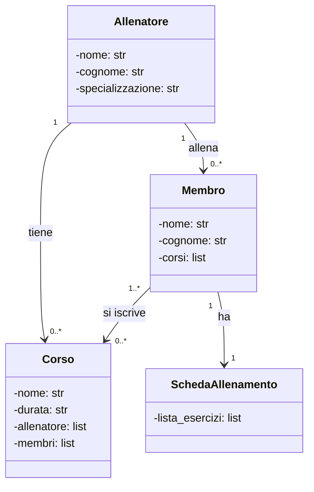

```mermaid
classDiagram
    class Allenatore {
        -nome: str
        -cognome: str
        -specializzazione: str        
    }

    class Membro {
        -nome: str
        -cognome: str
        -corsi: list
    }

    class Corso {
        -nome: str
        -durata: str
        -allenatore: list
        -membri: list
    }

    class SchedaAllenamento {
        -lista_esercizi: list
    }

Allenatore "1" --> "0..*" Membro: allena
Membro "1..*" --> "0..*" Corso: si iscrive
Allenatore "1" --> "0..*" Corso: tiene
Membro "1" --> "1" SchedaAllenamento: ha
```