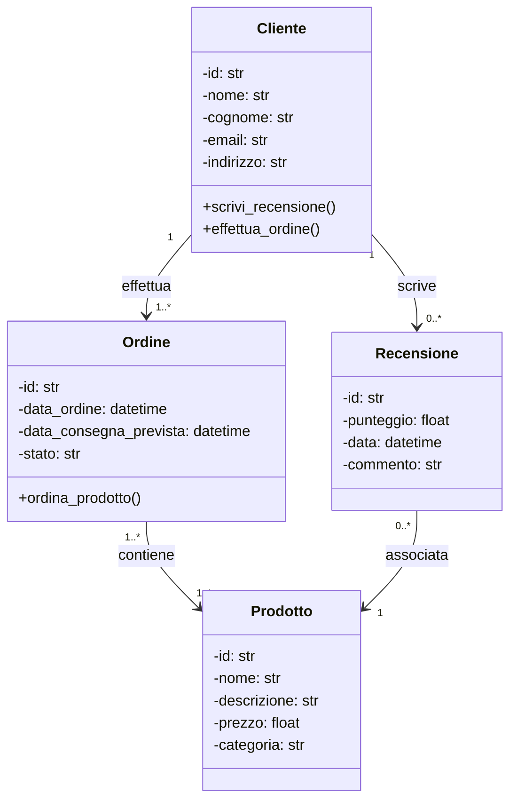

```mermaid
classDiagram
    class Prodotto {
        -id: str
        -nome: str
        -descrizione: str
        -prezzo: float
        -categoria: str        
    }

    class Cliente {
        -id: str
        -nome: str
        -cognome: str
        -email: str
        -indirizzo: str
        +scrivi_recensione()
        +effettua_ordine()
    }

    class Ordine {
        -id: str
        -data_ordine: datetime
        -data_consegna_prevista: datetime
        -stato: str
        +ordina_prodotto()
    }

    class Recensione {
        -id: str
        -punteggio: float
        -data: datetime
        -commento: str
    }

Cliente "1" --> "1..*" Ordine: effettua
Ordine "1..*" --> "1..*" Prodotto: contiene
Cliente "1" --> "0..*" Recensione: scrive
Recensione "0..*" --> "1" Prodotto: associata
```