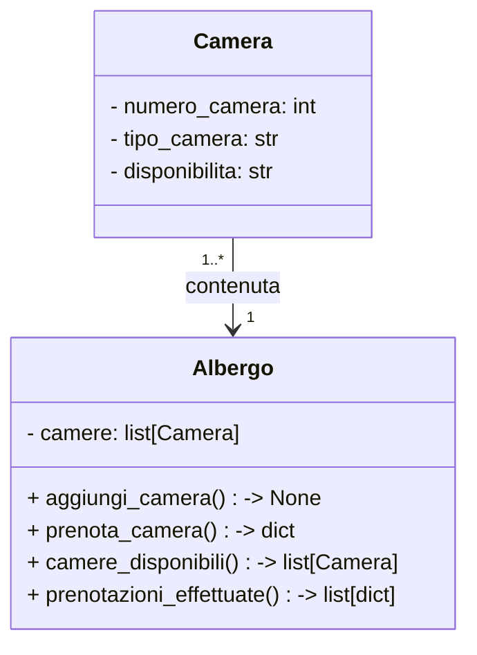

```mermaid
classDiagram
    class Albergo {
        - camere: list[Camera]

        + aggiungi_camera() -> None
        + prenota_camera() -> dict
        + camere_disponibili() -> list[Camera]
        + prenotazioni_effettuate() -> list[dict]
    }

    class Camera {
        - numero_camera: int
        - tipo_camera: str
        - disponibilita: str
    }

Camera "1..*" --> "1" Albergo: contenuta
```