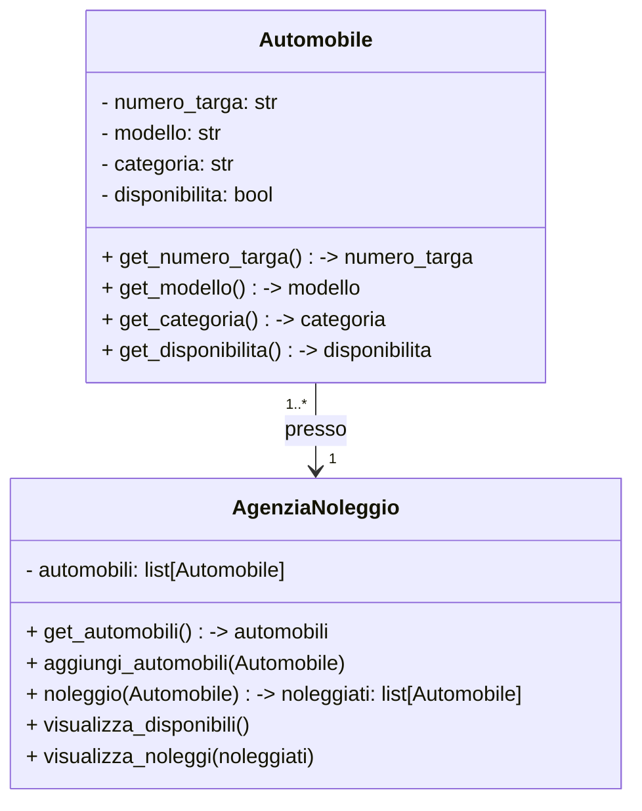

```mermaid
classDiagram
    class Automobile {
        - numero_targa: str
        - modello: str
        - categoria: str
        - disponibilita: bool
        + get_numero_targa() -> numero_targa
        + get_modello() -> modello
        + get_categoria() -> categoria
        + get_disponibilita() -> disponibilita
    }

    class AgenziaNoleggio {
        - automobili: list[Automobile]
        + get_automobili() -> automobili
        + aggiungi_automobili(Automobile)
        + noleggio(Automobile) -> noleggiati: list[Automobile]
        + visualizza_disponibili()
        + visualizza_noleggi(noleggiati)
    }

Automobile "1..*" --> "1" AgenziaNoleggio: presso
```