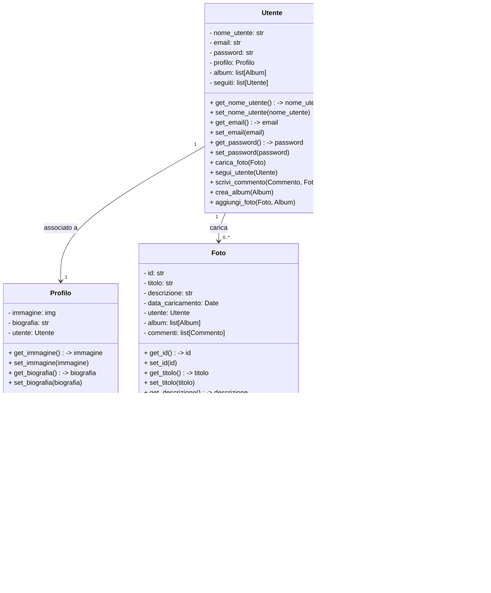

```mermaid
classDiagram
    class Utente {
        - nome_utente: str
        - email: str
        - password: str
        - profilo: Profilo
        - album: list[Album]
        - seguiti: list[Utente]
        + get_nome_utente() -> nome_utente
        + set_nome_utente(nome_utente)
        + get_email() -> email
        + set_email(email)
        + get_password() -> password
        + set_password(password)
        + carica_foto(Foto)
        + segui_utente(Utente)
        + scrivi_commento(Commento, Foto)
        + crea_album(Album)
        + aggiungi_foto(Foto, Album)
        }

    class Profilo {
        - immagine: img
        - biografia: str
        - utente: Utente
        + get_immagine() -> immagine
        + set_immagine(immagine)
        + get_biografia() -> biografia
        + set_biografia(biografia)
        }

    class Foto {
        - id: str
        - titolo: str
        - descrizione: str
        - data_caricamento: Date
        - utente: Utente
        - album: list[Album]
        - commenti: list[Commento]
        + get_id() -> id
        + set_id(id)
        + get_titolo() -> titolo
        + set_titolo(titolo)
        + get_descrizione() -> descrizione
        + set_descrizione(descrizione)
        + get_data_caricamento() -> data_caricamento
        + set_data_caricamento(data_caricamento)
        }

    class Album {
        - titolo: str
        - descrizione: str
        - utente: Utente
        - foto: list[Foto]
        + get_titolo() -> titolo
        + set_titolo(titolo)
        + get_descrizione() -> descrizione
        + set_descrizione(descrizione)

        }
    
    class Commento {
        - descrizione: str
        - foto: Foto
        - utente: Utente
        + get_descrizione() -> descrizione
        + set_descrizione(descrizione)
        }

Utente "1" --> "0..*" Foto: carica
Foto "1" --> "0..*" Commento: ha
Commento "0..*" --> "1" Utente: scritti da
Foto "0..*" --> "0..*" Album: in
Album "0..*" --> "1" Utente: appartiene
Utente "1" --> "1" Profilo: associato a
```