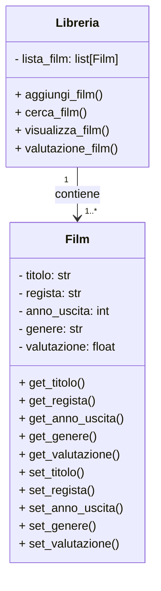

```mermaid
classDiagram
    class Film {
        - titolo: str
        - regista: str
        - anno_uscita: int
        - genere: str
        - valutazione: float
        + get_titolo()
        + get_regista()
        + get_anno_uscita()
        + get_genere()
        + get_valutazione()
        + set_titolo()
        + set_regista()
        + set_anno_uscita()
        + set_genere()
        + set_valutazione()
        }
    
    class Libreria {
        - lista_film: list[Film]
        + aggiungi_film()
        + cerca_film()
        + visualizza_film()
        + valutazione_film()
        }

Libreria "1" --> "1..*" Film: contiene    

```