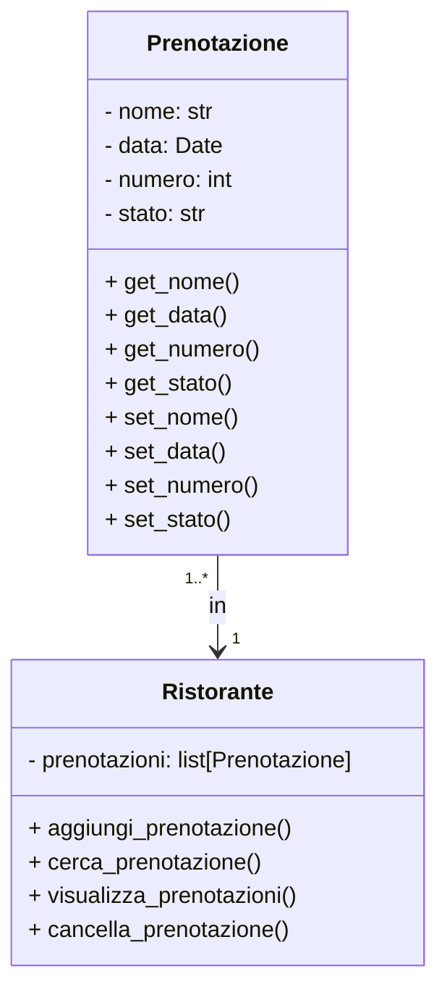

```mermaid
classDiagram
    class Prenotazione {
        - nome: str
        - data: Date
        - numero: int
        - stato: str
        + get_nome()
        + get_data()
        + get_numero()
        + get_stato()
        + set_nome()
        + set_data()
        + set_numero()
        + set_stato()
        }

    class Ristorante {
        - prenotazioni: list[Prenotazione]
        + aggiungi_prenotazione()
        + cerca_prenotazione()
        + visualizza_prenotazioni()
        + cancella_prenotazione()
        }

Prenotazione "1..*" --> "1" Ristorante: in
```