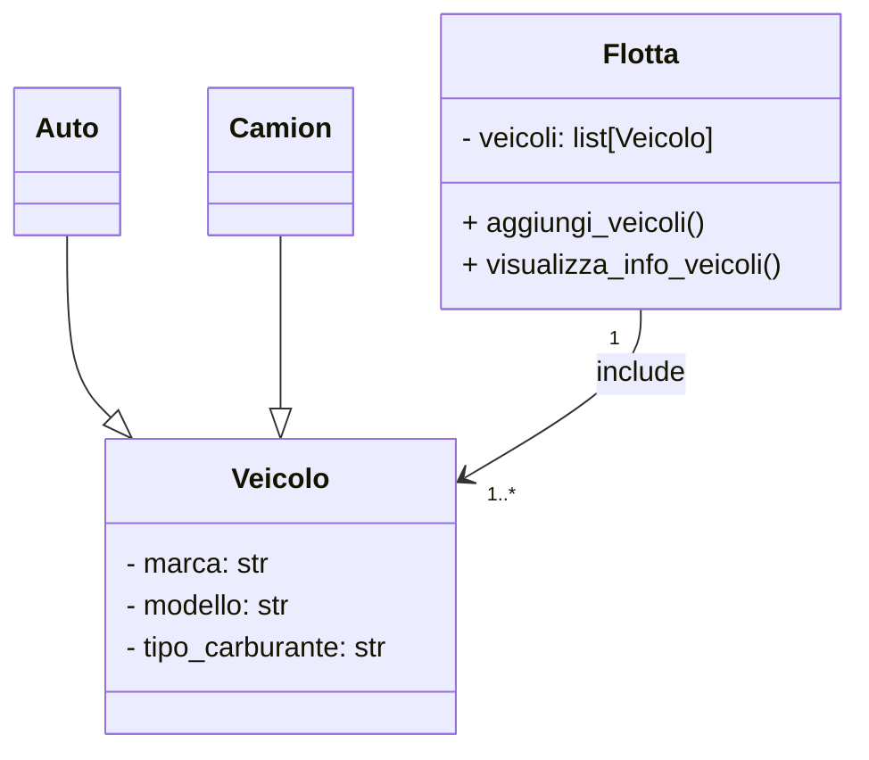

```mermaid
classDiagram
    class Veicolo {
        - marca: str
        - modello: str
        - tipo_carburante: str
        }

    class Auto {
        }
    
    class Camion {
        }

    class Flotta {
        - veicoli: list[Veicolo]
        + aggiungi_veicoli()
        + visualizza_info_veicoli()
        }

Auto --|> Veicolo
Camion --|> Veicolo
Flotta "1" --> "1..*" Veicolo: include
```