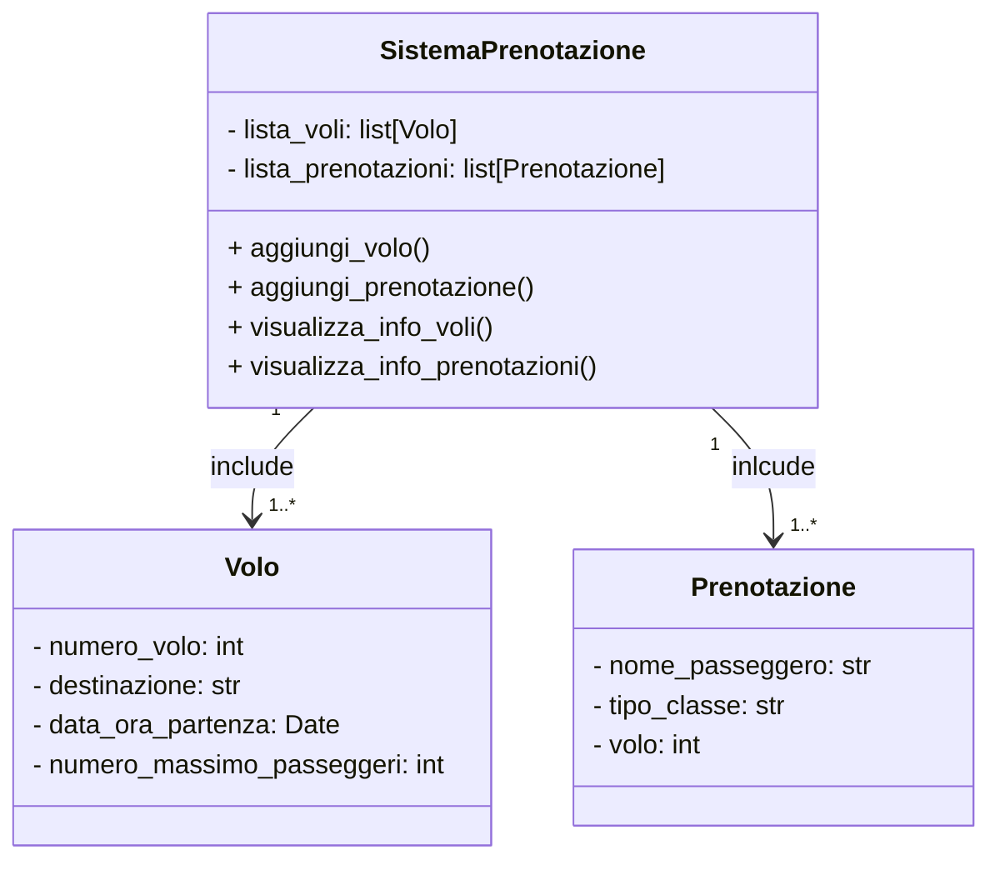

```mermaid
classDiagram
    class Volo {
        - numero_volo: int
        - destinazione: str
        - data_ora_partenza: Date
        - numero_massimo_passeggeri: int
        }
    
    class Prenotazione {
        - nome_passeggero: str
        - tipo_classe: str
        - volo: int
        }
    
    class SistemaPrenotazione {
        - lista_voli: list[Volo]
        - lista_prenotazioni: list[Prenotazione]
        + aggiungi_volo()
        + aggiungi_prenotazione()
        + visualizza_info_voli()
        + visualizza_info_prenotazioni()
        }

SistemaPrenotazione "1" --> "1..*" Volo: include
SistemaPrenotazione "1" --> "1..*" Prenotazione: inlcude
```