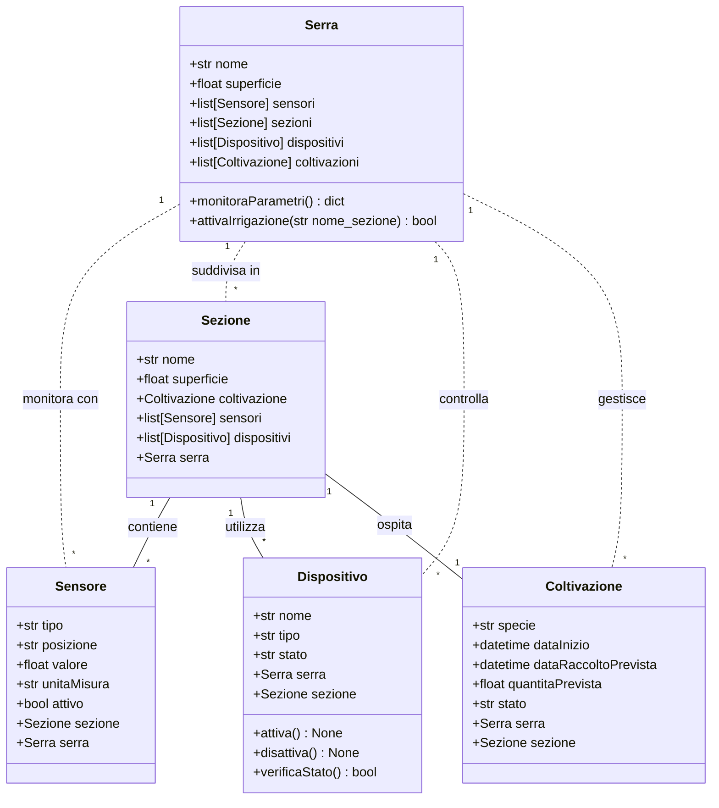

### Serra automatizzata

Un'azienda agricola moderna vuole automatizzare la gestione della propria serra. Ogni serra viene utilizzata per diverse coltivazioni e deve essere monitorata costantemente. Per garantire la crescita ottimale delle _piante_, vengono utilizzati vari dispositivi e sensori che controllano le condizioni ambientali.

Le serre sono divise in sezioni separate per ospitare colture diverse che richiedono condizioni specifiche. _Il sistema deve tenere traccia di cosa viene coltivato, quando è stato piantato e quando si prevede il raccolto. Per ogni coltivazione, si deve poter calcolare lo stadio di crescita e stimare la quantità prevista al raccolto._

I vari dispositivi presenti nella serra (come irrigatori, ventilatori, luci) possono essere attivati o disattivati. I sensori forniscono continuamente letture delle condizioni ambientali attraverso un metodo di rilevazione.

_Il sistema deve essere in grado di intervenire automaticamente su una determinata sezione quando necessario, monitorando i parametri ambientali di tutta la serra (attraverso il metodo monitoraParametri che restituisce un dizionario con i valori rilevati) e attivando l'irrigazione (tramite il metodo attivaIrrigazione che attiva tutti i dispositivi di tipo irrigatore presenti nella sezione specificata)_.