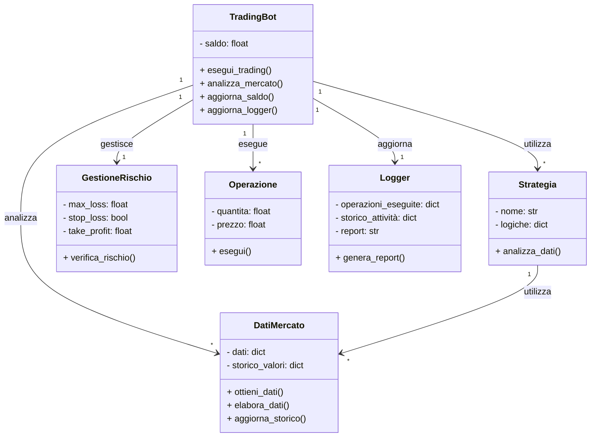

```mermaid
    classDiagram
        class TradingBot {
            - saldo: float
            + esegui_trading()
            + analizza_mercato() 
            + aggiorna_saldo()
            + aggiorna_logger()
        }

        class Strategia {
            - nome: str
            - logiche: dict
            + analizza_dati()
        }

        class GestioneRischio {
            - max_loss: float
            - stop_loss: bool
            - take_profit: float
            + verifica_rischio()
        }

        class DatiMercato {
            - dati: dict
            - storico_valori: dict
            + ottieni_dati()
            + elabora_dati()
            + aggiorna_storico()
        }

        class Operazione {
            - quantita: float
            - prezzo: float
            + esegui()
        }

        class Logger {
            - operazioni_eseguite: dict
            - storico_attività: dict
            - report: str
            + genera_report()     
        }

        TradingBot "1" --> "*" Strategia: utilizza
        TradingBot "1" --> "1" GestioneRischio: gestisce
        TradingBot "1" --> "*" DatiMercato: analizza
        Strategia "1" --> "*" DatiMercato: utilizza
        TradingBot "1" --> "*" Operazione: esegue
        TradingBot "1" --> "1" Logger: aggiorna
```