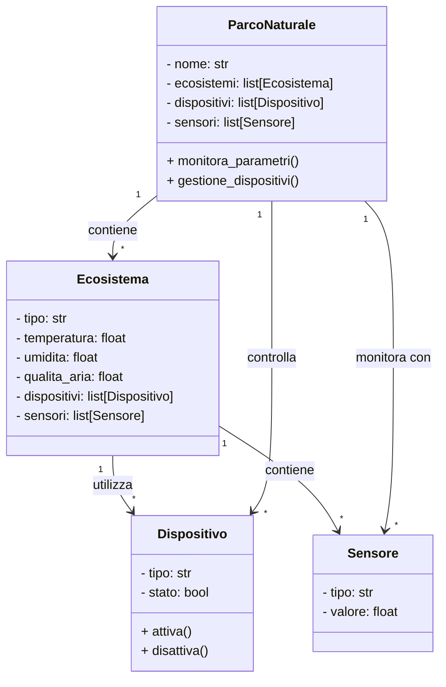

```mermaid
    classDiagram
    class ParcoNaturale {
        - nome: str
        - ecosistemi: list[Ecosistema]
        - dispositivi: list[Dispositivo]
        - sensori: list[Sensore]
        + monitora_parametri()
        + gestione_dispositivi()
    }

    class Ecosistema {
        - tipo: str
        - temperatura: float
        - umidita: float
        - qualita_aria: float
        - dispositivi: list[Dispositivo]
        - sensori: list[Sensore]
    }

    class Dispositivo {
        - tipo: str
        - stato: bool
        + attiva()
        + disattiva()
    }

    class Sensore {
        - tipo: str
        - valore: float
        }

    ParcoNaturale "1" --> "*" Ecosistema: contiene
    Ecosistema "1" --> "*" Dispositivo: utilizza
    Ecosistema "1" --> "*" Sensore: contiene
    ParcoNaturale "1" --> "*" Dispositivo: controlla
    ParcoNaturale "1" --> "*" Sensore: monitora con
```