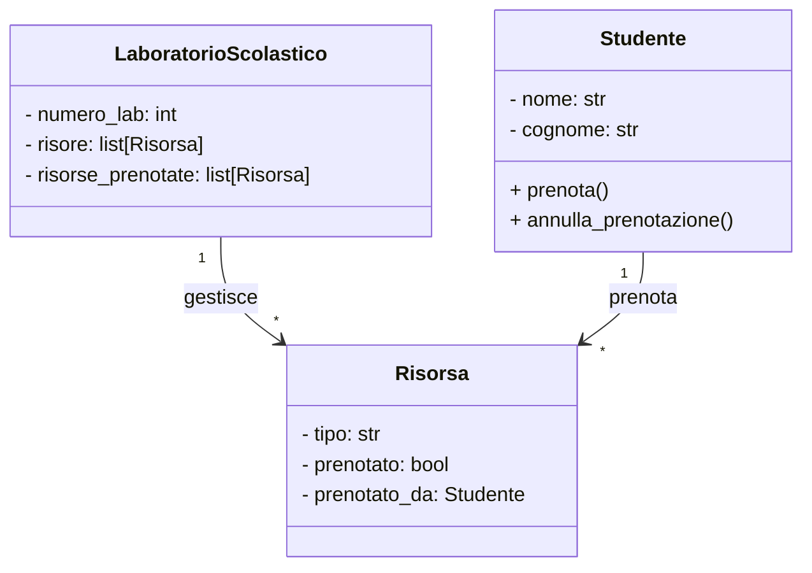

```mermaid
classDiagram
    class LaboratorioScolastico {
        - numero_lab: int
        - risore: list[Risorsa]
        - risorse_prenotate: list[Risorsa]
        }
    
    class Studente {
        - nome: str
        - cognome: str
        + prenota()
        + annulla_prenotazione()
        }
    
    class Risorsa {
        - tipo: str
        - prenotato: bool
        - prenotato_da: Studente
        }
    
    LaboratorioScolastico "1" --> "*" Risorsa: gestisce
    Studente "1" --> "*" Risorsa: prenota
```