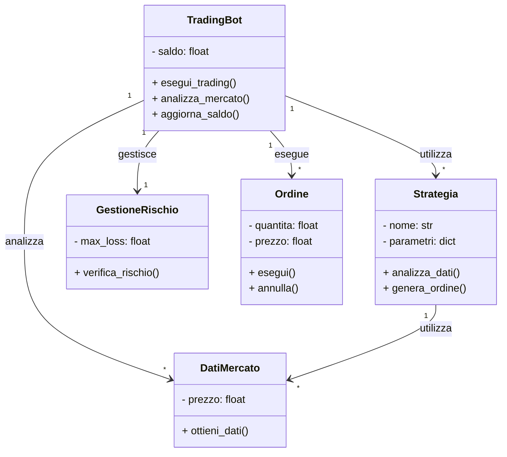

```mermaid
    classDiagram
        class TradingBot {
            - saldo: float
            + esegui_trading()
            + analizza_mercato() 
            + aggiorna_saldo()
        }

        class Strategia {
            - nome: str
            - parametri: dict
            + analizza_dati()
            + genera_ordine()
        }

        class GestioneRischio {
            - max_loss: float
            + verifica_rischio()
        }

        class DatiMercato {
            - prezzo: float
            + ottieni_dati()
        }

        class Ordine {
            - quantita: float
            - prezzo: float
            + esegui()
            + annulla()
        }

        TradingBot "1" --> "*" Strategia: utilizza
        TradingBot "1" --> "1" GestioneRischio: gestisce
        TradingBot "1" --> "*" DatiMercato: analizza
        Strategia "1" --> "*" DatiMercato: utilizza
        TradingBot "1" --> "*" Ordine: esegue
```