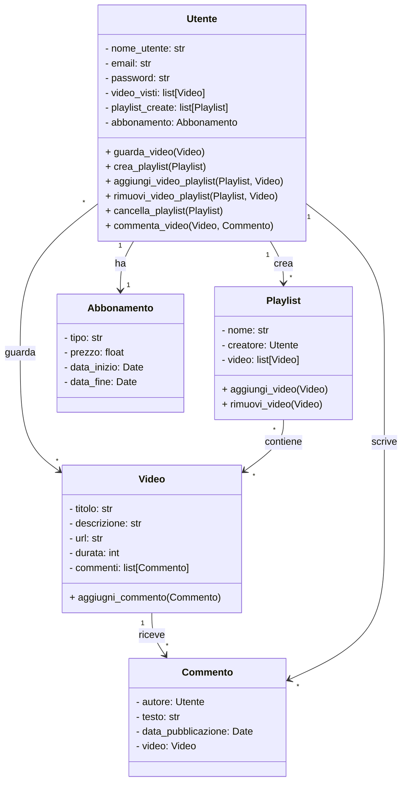

```mermaid
classDiagram
    class Utente {
        - nome_utente: str
        - email: str
        - password: str
        - video_visti: list[Video]
        - playlist_create: list[Playlist]
        - abbonamento: Abbonamento
        + guarda_video(Video)
        + crea_playlist(Playlist)
        + aggiungi_video_playlist(Playlist, Video)
        + rimuovi_video_playlist(Playlist, Video)
        + cancella_playlist(Playlist)
        + commenta_video(Video, Commento)
    }

    class Video {
        - titolo: str
        - descrizione: str
        - url: str
        - durata: int
        - commenti: list[Commento]
        + aggiugni_commento(Commento)
    }

    class Playlist {
        - nome: str
        - creatore: Utente
        - video: list[Video]
        + aggiungi_video(Video)
        + rimuovi_video(Video)
    }

    class Abbonamento {
        - tipo: str
        - prezzo: float
        - data_inizio: Date
        - data_fine: Date
    }

    class Commento {
        - autore: Utente
        - testo: str
        - data_pubblicazione: Date
        - video: Video
    }

    Utente "*" --> "*" Video : guarda
    Utente "1" --> "*" Playlist : crea
    Playlist "*" --> "*" Video : contiene
    Utente "1" --> "1" Abbonamento : ha
    Video "1" --> "*" Commento : riceve
    Utente "1" --> "*" Commento: scrive
```