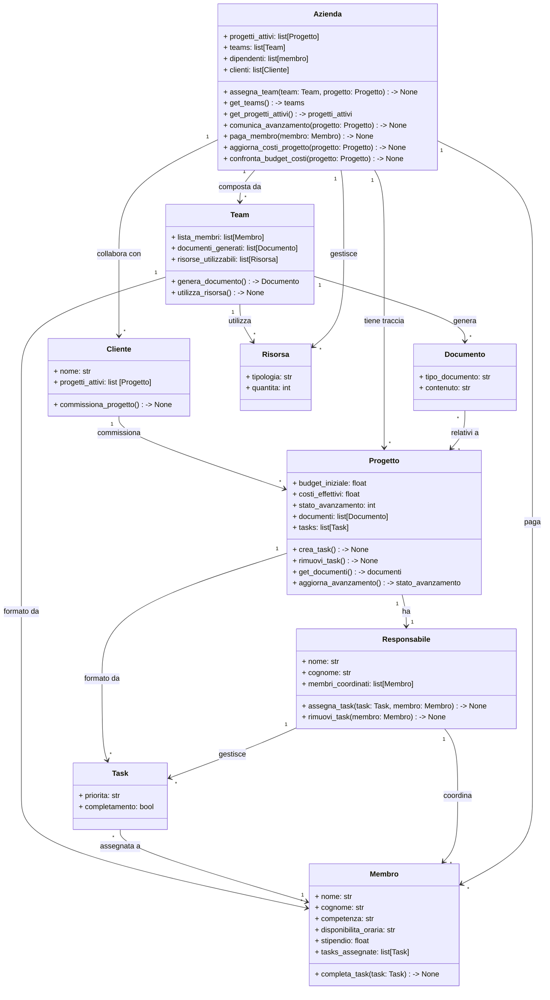

Azienda è la classe principale, ha una gestione generale e può assegnare team a diversi progetti, gestire i costi dei progetti e comunicare con il cliente.

Un cliente può commissionare diversi progetti che vengono divisi in tasks e assegnati ai vari membri dal responsabile del progetto.

Ho creato una classe a parte per Documento per relazionarli più facilmente con i progetti e assegnargli degli attributi.
