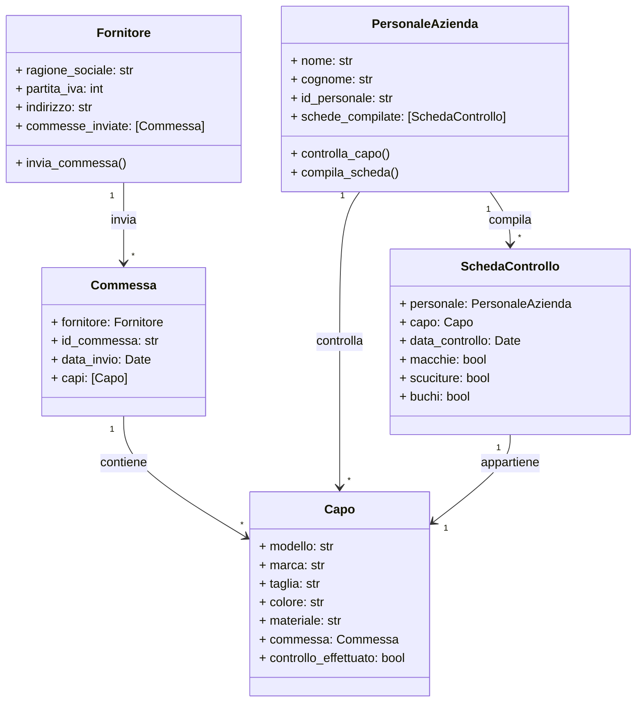

```mermaid
classDiagram
    class Fornitore {
        + ragione_sociale: str
        + partita_iva: int
        + indirizzo: str
        + commesse_inviate: [Commessa]
        + invia_commessa()
    }

    class Capo {
        + modello: str
        + marca: str
        + taglia: str
        + colore: str
        + materiale: str
        + commessa: Commessa
        + controllo_effettuato: bool
    }

    class Commessa {
        + fornitore: Fornitore
        + id_commessa: str
        + data_invio: Date
        + capi: [Capo]
    }

    class PersonaleAzienda {
        + nome: str
        + cognome: str
        + id_personale: str
        + schede_compilate: [SchedaControllo]
        + controlla_capo()
        + compila_scheda()
    }

    class SchedaControllo {
        + personale: PersonaleAzienda
        + capo: Capo
        + data_controllo: Date
        + macchie: bool
        + scuciture: bool
        + buchi: bool
    }

Fornitore "1" --> "*" Commessa: invia
Commessa "1" --> "*" Capo: contiene
PersonaleAzienda "1" --> "*" Capo: controlla
PersonaleAzienda "1" --> "*" SchedaControllo: compila
SchedaControllo "1" --> "1" Capo: appartiene
```